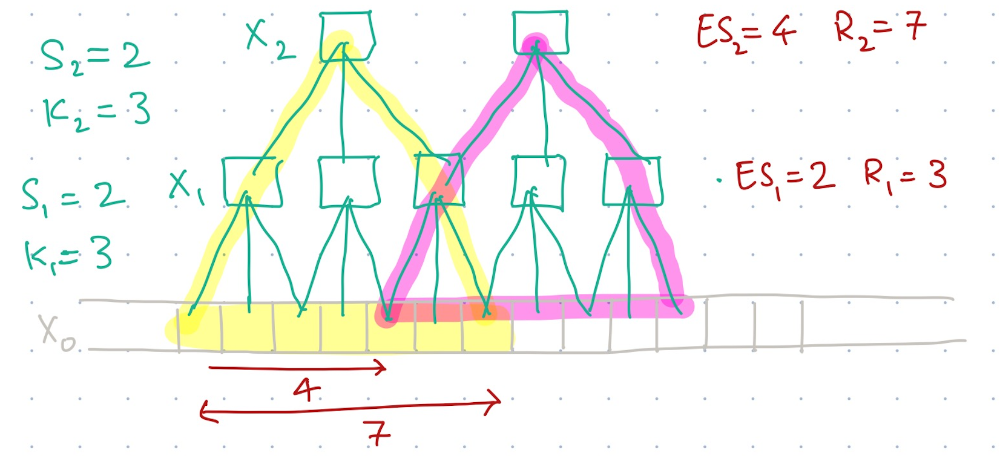

## CS 444: Deep Learning for Computer Vision, Fall 2024, Assignment 2

### Instructions

1. Assignment is due at **11:59:59 PM on Tuesday Oct 15 2024**.

2. See [policies](https://saurabhg.web.illinois.edu/teaching/cs444/fa2024/policies.html)
   on [class website](https://saurabhg.web.illinois.edu/teaching/cs444/fa2024).

3. Submission instructions:
    1. On gradescope assignment called `MP2-code`, upload the following 6 files:
        - Your completed `layers.py` and `losses.py`, for problems 1 and 2. We will run tests to evaluate your code.
        - Predictions from your custom cnn (`pred_custom_cnn.txt`) and from a finetuned ResNet (`pred_resnet_ft.txt`) for problem 3. See `simple_pytorch.ipynb` for code that generates these files. We will compare your predictions to ground truth test labels and report back an accuracy. Score will be based on the accuracy of your predictions.
        - Scripts (`script_custom_cnn.py` and `script_resnet_ft.py`) for problem 3 that are entirely self-contained and replicate the predictions that you have submitted. The scripts should contain your model and be runnable to replicate your results. You can use the notebook `simple-pytorch.ipynb` to generate the scripts by editing the model and remove parts not needed. See `simple-pytorch.ipynb` for more details.
       
       Please also note the following points:
        - Do not compress the files into `.zip` as this will not work.
        - Do not change the provided files names nor the names of the functions but rather change the code inside the provided functions and add new functions. Also, make sure that the inputs and outputs of the provided functions are not changed.
        - The autograder will give you feedback on how well your code did.
        - The autograder is configured with the python libraries: `numpy absl-py tqdm` only.

    3. On gradescope assignment called `MP2-report`, fill up the text response to questions along with supporting figures and plots.

    4. We reserve the right to take off points for not following submission instructions. Specifically, we will be inspecting and, if necessary, running your training scripts (`script_custom_cnn.py` and `script_resnet_ft.py`). If scripts are not submitted / do not run / do not reasonably reproduce your claimed performance, you will lose points for problem 3.

4. Lastly, be careful not to work of a public fork of this repo. Make a private clone to work on your assignment. You are responsible for preventing other students from copying your work. Please also see point 2 above.

### Problems

In this MP, your will try to implement a few layers in a neural network from
scratch. You will implement the forward and backward pass for the `ReLU`, `Sequential`, 
`Conv2d`, and `MaxPool2d` layers in `layers.py` as well as the `CrossEntropyLoss
` function in `losses.py`. You will then use these layers to train a
convolutional neural networks on the MNIST dataset.

Each of these neural network and loss layer has a `forward` and `backward`
function. The forward pass calculates the output of the layer given the input. 
It also stores the necessary information needed for backpropagation.  Given the
upstream gradient, the backward pass calculates a) the gradient of the loss with
respect to the input, and b) stores the gradient of the loss function with
respect to the layer parameters (if any). As an example, you can refer to the
`Linear` and `Flatten` class in `layers.py` and the `L2Loss` class in
`losses.py` that we have already implemented.

1. **Fully Connected Neural Netowrk**
   
    1.1 [1 pts Autograded] Complete the `ReLU` class in `layers.py`. 
    $$\text{ReLU}(x) = \max(0, x)$$
    
    You can test your implementation by running 
    ```bash
    python -m unittest test_layers.TestLayersAndLosses.test_layer_relu_forward \
      test_layers.TestLayersAndLosses.test_layer_relu_grad_input -v 
    ```
    
    1.2 [1 pts Autograded] Complete the `SoftmaxWithLogitsLoss` class in `losses.py`. 
    $$\text{SoftmaxWithLogitsLoss}(x, y) = \frac{1}{N}\sum_{n=1}^N -\log\text{softmax}(x_n)_{y_n}$$
    where $x$ is the input to the loss layer and $y$ is the ground truth label. $N$ is the number of samples in the batch.

    Hint: use the results from 1.2 to calculate the gradient. You can test your implementation by running 
    
    ```bash
    python -m unittest test_layers.TestLayersAndLosses.test_loss_softmax_with_logits_forward \
      test_layers.TestLayersAndLosses.test_loss_softmax_with_logits_grad_x -v 
    ```
    
    1.3 [1 pts Autograded] As we have already provided the `Linear` class in `layers.py`, all you need to do is to stack everything together. Implement the `Sequential` class in `layers.py`. Note that for each layer is expected to have a dictionary called `grads` in the backward function. You can test your implementation by running 
    
    ```bash
    python -m unittest test_layers.TestLayersAndLosses.test_sequential -v 
    ```
    
    Once you have passed the test, you can now train a linear classifier with the following command:
    
    ```bash
    # Took about 8s and gave an accuracy of 85.3% on the valid set.
    python demo.py --classifier linear --lr 1e-2 --gamma 0.9 --epochs 10
    ```
    
    After that, you can also train a 2-layer network with the following command:
    
    ```bash
    # Took about 24s and gave an accuracy of 87.6% on the valid set.
    python demo.py --classifier nn --lr 1e-2 --gamma 0.9 --epochs 10
    ```


2. **Convolutional Neural Network**

    2.1 [3 pts Manually Graded] 
    Consider a 1D convolutional neural network comprising of L layers. Let
    $K_i$ and $S_i$ denote the kernel size and the stride for the convolution
    in layer $i$. Assume that $S_i < K_i$. Let $X_0$ denote the input to this
    1D CNN and $X_i$ denote the activations after being processed by the
    $i^{th}$ convolutional layer.

    Recall that receptive field $R_i$ of a neuron in $X_i$ is the number of
    pixels in $X_0$ that the value of that neuron in $X_i$ depends upon. Also
    recall the effective stride $ES_i$ of a activations in $X_i$ is the number
    of pixels in $X_0$ that the receptive fields of two consecuitive activations
    in $X_i$ are offset by. For the following example CNN with $K_1 = K_2 = 3$
    and $S_1 = S_2 = 2$, effective stride $ES_1 = 2, ES_2 = 4$ and receptive
    fields $R_1 = 3$ and $R_2 = 7$.
    
    

    Derive an expression for $ES_i$ (i.e., the effective stride for a neuron
    in $X_i$) as a function of $K_{1,...,L}$, $S_{1,...,L}$ and
    $ES_{1,...,i-1}$. Also derive an expression for $R_i$ (i.e. the receptive
    field for a neuron in $X_i$) as a function of $K_{1,...,L}$, $S_{1,...,L}$,
    $ES_{1,...,i-1}$ and $R_{1,...,i-1}$.  
     

    2.2 [3 pts Autograded] Complete the `MaxPool2d` class in `layers.py`: 
    $$\text{MaxPool2d}(x)\_{i, h, w, c} = \max_{m, n} x_{i, m + hk_h, n + wk_w, c}$$
    where $x$ is the input to the layer and $m,n$ range from 0 to the kernel size, $k_h$ and $k_w$ respectively. Here are some hints that may help you implement the max-pooling layer:

    - Only the maximum value in each window is kept. Therefore, only these pixels have non-zero gradients.
    - The input size is `(N, H, W, C)`, with each dimension denoting the batch size, height, width, and number of channels, respectively.
    - The kernel size is `(k_h, k_w)`.
    - The out size should be `(N, H // k_h, W // k_w, C)`. To simplify matters, you can assume that the height and the width are divisible by the kernel size.
    - You don't need to vectorize the implementation. You may use a double for-loop to iterate over the input.

    You can test your implementation by running
    ```bash
    python -m unittest test_layers.TestLayersAndLosses.test_layer_maxpool_forward \
      test_layers.TestLayersAndLosses.test_layer_maxpool_grad_input -v 
    ```

    2.3 [4 pts Autograded] Complete the `Conv2d` class in `layers.py`:
    $$\text{Conv2d}(x)\_{i, h, w, c} = \sum_{k=1}^{C_\text{in}} \sum_{m, n} x_{i, h + m, w + n, k} \cdot w_{c, k, m, n} + b_c$$
    where $x$ is the input to the layer, $w$ is the weight tensor, $b$ is the bias vector, $k$ is the index of input channels ranging from 1 to $C_\text{in}$, $c$ is the index of output channels, and $m, n$ range from 0 to the kernel size, $k_h$ and $k_w$. Here are some hints that may help you implement the 2d convolutional layer:

   - The input size is `(N, H, W, C_in)` with `C_in` denoting the number of input channels.
   - Recall the size of the kernel weight is `(C_out, C_in, k_h, k_w)` and the size of the kernel bias is `(C_out,)`, where `C_out` denotes the number of output channels.
   - The out size should be `(N, H - k_h + 1, W - k_w + 1, C_out)`. This means we don't pad the input and use a stride of 1
   - You don't need to vectorize the implementation.
   - You may want to store the input for the backward pass.

    You can test your implementation by running
    ```bash
    python -m unittest test_layers.TestLayersAndLosses.test_layer_conv2d_forward \
      test_layers.TestLayersAndLosses.test_layer_conv2d_grad_param \
      test_layers.TestLayersAndLosses.test_layer_conv2d_grad_input -v 
    ```
    
    After that, you can train a convolutional neural network with the following command (this is NOT mandatory, as the naive implementation is very slow):
    
    ```bash
    # Took about 20 min on our highly optimized code, and gave an accuracy of 89.2% on the valid set.
    python demo.py --classifier cnn --lr 1e-2 --gamma 0.9 --epochs 2
    ```
   
    2.4 [2 pts Manually Graded] You have successfully implemented the 2D convolutional layer. To get a more intuitive understanding of the convolutional layer, we have provided some convolutional kernels widely used in image processing. They are known as the **image filters**. By applying these filters to the input image, you can see what the convolutional layer is doing. Include visualization of the output and describe what you see in your response on gradescope in `MP2-report`. You can use the following command to generate the output image:
    
    ```bash  
    python filter_image.py --filter gaussian
    ```
   
    Test with filter options of `['gaussian', 'grad_x', 'grad_y', 'sobel_x']` and discuss your observations for all 4 cases in the report.

3. **Using PyTorch [Auto + Manually Graded]**.

    Follow the instruction and complete the Jupyter Notebook
    [simple-pytorch.ipynb](simple-pytorch.ipynb). We highly recommend using a
    GPU, though it is not mandatory. [Google
    Colab](https://colab.research.google.com/) is a good option if you don't
    have a GPU on your local machine. If you are not familiar with Jupyter
    Notebook/Lab, you can refer to [this
    tutorial](https://www.dataquest.io/blog/jupyter-notebook-tutorial/) or the
    [official doc](https://docs.jupyter.org/en/latest/).
